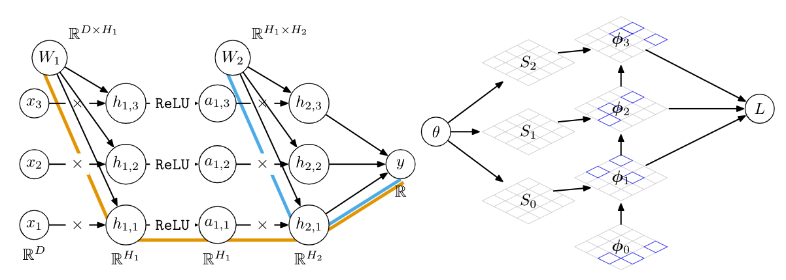

# Randomized Automatic Differentiation



This repository contains code for all three types of experiments used in the paper:
1. Feedforward network experiments described in ``nn_experiments/README_ff.md``
2. Recurrent network experiments described in ``nn_experiments/README_rnn.md``
3. PDE experiments described in ``diffusionsim_experiments/README_diffusionsim.md``

For the neural network experiments, the layers using randomized autodiff are in ``nn_experiments/layers.py``.

## Citation
To cite this work, please use
```
```

## Authors:
* [Deniz Oktay](http://www.cs.princeton.edu/~doktay/)
* [Nick McGreivy](https://scholar.princeton.edu/nickmcgreivy/home)
* [Joshua Aduol]()
* [Alex Beatson](https://www.cs.princeton.edu/~abeatson/)
* [Ryan P. Adams](https://www.cs.princeton.edu/~rpa/)
